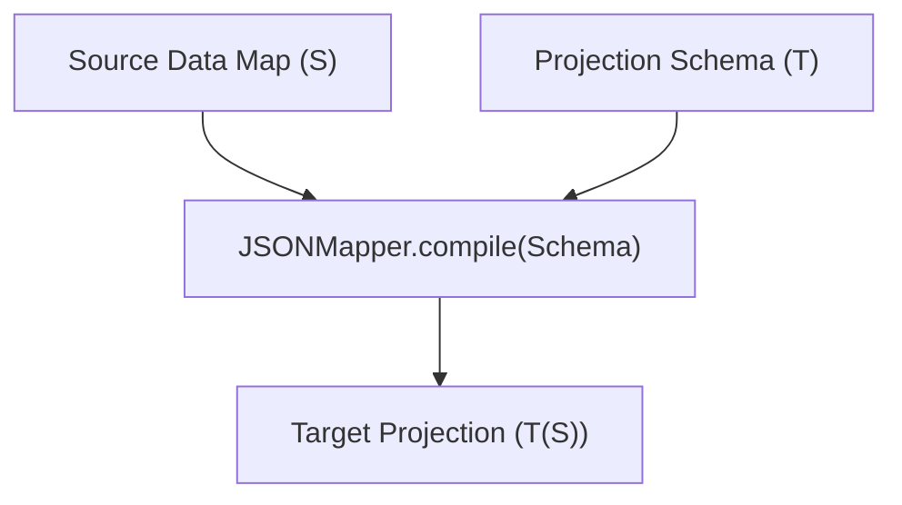

# Step 0: The Functional Domain Assessment (json-mapper)

This document provides a retroactive, pure-domain specification of the `json-mapper` utility. It formalizes the core data models, the path-traversal algorithm, and the edge-case handling logic, completely isolated from infrastructural delivery mechanisms such as file I/O or CLI interpreters.

---

## 1. Abstract Schema Contracts

The functional domain of `json-mapper` models two primary abstract structures: the **Source Domain Object Hierarchy** and the **Target Projection Schema**. Together, they formulate a deterministic transformation of a source dataset into a projected output structure.

### The Source Dataset ($S$)
Let $S$ be a sequential collection of structured domain entities:
$$S = [s_1, s_2, \dots, s_n]$$
Where each $s_i \in S$ is a **Source Entity Map** modeled as a tree structure of nested dictionaries (keys mapped to values) and sequential lists (indexed arrays).

### The Projection Schema ($T$)
The schema $T$ specifies the template of the target structure. It is recursively defined as one of three abstract nodes:

1.  **Leaf Schema Node ($\mathbf{T_{leaf}}$)**: 
    A terminal projection primitive holding a **Path Query String** $P$. The value of this node in the target output is retrieved by resolving $P$ against the source entity map.
    $$\mathbf{T_{leaf}} \in \text{String}$$

2.  **Array Schema Node ($\mathbf{T_{array}}$)**: 
    A sequential collection of child schemas that models an ordered target list.
    $$\mathbf{T_{array}} = [T_1, T_2, \dots, T_k]$$

3.  **Object Schema Node ($\mathbf{T_{object}}$)**: 
    A set of named mapping pairs representing a target complex structure.
    $$\mathbf{T_{object}} = \{ k_1: T_1, k_2: T_2, \dots, k_m: T_m \}$$

### The Target Projection ($T(s)$)
For any source entity map $s$, the projected output structure $T(s)$ preserves the exact structural topology of the schema $T$ (objects mapped to objects, arrays mapped to arrays) but with all leaf path queries resolved to concrete data values extracted from $s$.

---

## 2. Pure Transformation Logic

The core behavioral mechanics of the mapper consist of two phases: **Schema Compilation** and **Path Resolution**.

### Schema Compilation
Before executing data transformations, the declarative schema $T$ is compiled into an Abstract Syntax Tree (AST) composed of domain composite nodes. Let the compilation function be $\mathcal{C}(T)$:

$$\mathcal{C}(T) = \begin{cases} 
\text{LeafMappingNode}(P) & \text{if } T \in \text{String} \\
\text{ArrayMappingNode}([\mathcal{C}(T_1), \dots, \mathcal{C}(T_k)]) & \text{if } T = [T_1, \dots, T_k] \\
\text{ObjectMappingNode}(\{ k_i: \mathcal{C}(T_i) \}) & \text{if } T = \{ k_i: T_i \} 
\end{cases}$$

---

### Path Parsing Algorithm
For a given Leaf Path Query $P$, the query string is tokenized into a sequence of path segments:
$$\text{tokenize}(P) = \langle \sigma_1, \sigma_2, \dots, \sigma_d \rangle$$

Each segment $\sigma_i$ is mapped to a tuple:
$$\sigma_i = (K_i, \text{isIndexed}_i, I_i)$$

Where:
*   $K_i \in \text{String}$ is the alphanumeric identifier (property key).
*   $\text{isIndexed}_i \in \{\text{true}, \text{false}\}$ is a boolean flag indicating whether the segment targets an array subscript.
*   $I_i \in \mathbb{N}_0 \cup \{\text{null}\}$ is the numeric index, defined only if $\text{isIndexed}_i = \text{true}$.

#### Segment Matching Mechanics
The segmentation is executed using a strict regular expression boundary check. For each period-delimited substring `part` of the path:
1.  Match `part` against: `/^([^\[\]]+)(?:\[(\d+)\])?$/`
2.  If the match fails, the path segment is flagged as invalid.
3.  Let the first capture group be the key $K_i$.
4.  If the second capture group exists, it is parsed as a base-10 integer $I_i$, and $\text{isIndexed}_i = \text{true}$.
5.  Otherwise, $I_i = \text{null}$ and $\text{isIndexed}_i = \text{false}$.

> [!TIP]
> **Path Parser Optimization (Memoization)**
> Path compilation is computationally expensive. The system maintains a global map `pathCache` to memoize the tokenized structures of resolved paths:
> $$\text{pathCache}: P \mapsto \langle \sigma_1, \dots, \sigma_d \rangle$$
> This guarantees $O(1)$ amortized path tokenization complexity during warm execution loops.

---

### Path Traversal & Strategy-Driven Resolution
Once tokenized, the segment list $\langle \sigma_1, \sigma_2, \dots, \sigma_d \rangle$ is traversed sequentially against a source target context.

Let $\mathcal{R}(C, \sigma)$ represent the traversal step where $C$ is the current source context node and $\sigma = (K, \text{isIndexed}, I)$ is the active segment:

$$\mathcal{R}(C, \sigma) = \begin{cases} 
\text{undefined} & \text{if } C = \text{null} \lor C = \text{undefined} \\
\mathcal{R}_{array}(C, K, I) & \text{if } \text{isIndexed} = \text{true} \\
\mathcal{R}_{object}(C, K) & \text{if } \text{isIndexed} = \text{false}
\end{cases}$$

#### The Object Strategy ($\mathcal{R}_{object}$)
Extracts the property value directly from the map structure:
$$\mathcal{R}_{object}(C, K) = C[K]$$

#### The Array Strategy ($\mathcal{R}_{array}$)
First extracts the array property, validates its collection structure, and extracts the target index:
$$\mathcal{R}_{array}(C, K, I) = \begin{cases} 
\text{undefined} & \text{if } C[K] = \text{null} \lor C[K] = \text{undefined} \lor \neg \text{isArray}(C[K]) \\
C[K][I] & \text{otherwise}
\end{cases}$$

The traversal progresses recursively from the root entity $s$:
$$C_0 = s$$
$$C_i = \mathcal{R}(C_{i-1}, \sigma_i) \quad \text{for } i = 1, \dots, d$$
The final resolved value is $C_d$.

---

## 3. Edge-Case Invariant Guardrails

To operate reliably in high-throughput data environments, the mapping engine enforces several runtime safety constraints. The table below maps potential structural anomalies to their deterministic domain behaviors:

| Input/State Anomaly | Operational Impact | Invariant Guardrail Behavior |
| :--- | :--- | :--- |
| **Invalid Schema Type** | `typeof schema` not String, Array, or Object | **Throw Error**: `"Unsupported schema node type: [type]"` |
| **Null/Undefined Schema** | Schema argument is nullish | **Throw Error**: `"Schema cannot be null or undefined"` |
| **Source Collection Mismatch** | `mapCollection` input is not an Array | **Throw TypeError**: `"Source data must be an array of objects"` |
| **Empty Path Substring** | Schema contains path of `""` or `" "` | **Throw Error**: `"Path cannot be empty"` or `"Path must be a string"` |
| **Malformed Path Syntax** | Segment contains unbalanced brackets (e.g., `a[0`) | **Throw Error**: `"Invalid path segment: [segment]"` |
| **Missing Intermediate Key** | Key in path does not exist on source object | **Graceful Fallback**: Returns `undefined` safely (no runtime exception thrown) |
| **Intermediate Nullish Value** | Key exists but points to `null` or `undefined` | **Graceful Fallback**: Returns `undefined` safely |
| **Subscript Index on Non-Array** | Segment is `a[0]` but `a` is a primitive or dictionary | **Type Guard**: `Array.isArray` check fails, returns `undefined` safely |
| **Subscript Index Out of Bounds** | Target array size is $N$ and $I \ge N$ | **Native Fallback**: Returns `undefined` |

---

## 4. Key Object-Oriented Principles Applied

*   **Clean Architecture Dependency Rule**: The domain module coordinates the entire lookup logic strictly via abstract strategy definitions (`ObjectPropertyStrategy`, `ArrayIndexStrategy`), mapping them to the domain model entities. It has zero coupling with external input, output, or physical structures.
*   **GoF Composite Pattern**: By implementing `MappingNode`, the system treats composite nested nodes (`ObjectMappingNode`, `ArrayMappingNode`) and terminal mapping nodes (`LeafMappingNode`) with a completely uniform interface (`resolve(sourceData)`), enabling infinite recursive schema nesting.
*   **GoF Strategy Pattern**: The separation of array index resolution from object property resolution into distinct strategy classes (`ArrayIndexStrategy`, `ObjectPropertyStrategy`) isolates property-traversal policies, supporting seamless modular expansion.
