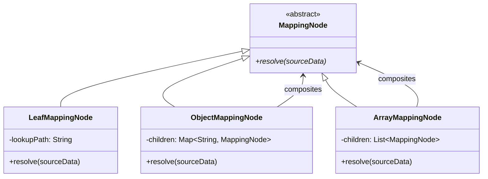

# Technical Design Specification: `json-mapper`

This document details the architectural blueprint and component design for `json-mapper`, a high-performance, modular, and patterns-driven Node.js CLI tool designed to structurally transform JSON arrays using a schema-based dictionary.

---

## 1. Architectural Boundaries (Clean Architecture)

Following the principles of Clean Architecture, the system is partitioned into concentric circles of control, with the core application policies residing in the center, entirely decoupled from peripheral infrastructure.

```mermaid
graph TD
    subgraph Infrastructure Layer (External Drivers)
        CLI[cli/bin.js]
        FS[fs/promises]
    end

    subgraph Adapters Layer (Interface Adapters)
        CLIController[adapters/controllers/CLIController.js]
        CLIPresenter[adapters/presenters/CLIPresenter.js]
        FileAdapter[adapters/repositories/FileRepositoryAdapter.js]
    end

    subgraph Use Cases Layer (Application Business Rules)
        MapUseCase[usecases/MapJsonUseCase.js]
        IFileRepo[usecases/ports/IFileRepository.js]
    end

    subgraph Domain Layer (Enterprise Business Rules)
        JSONMapper[domain/services/JSONMapper.js]
        LookupResolver[domain/services/LookupResolver.js]
        MappingNode[domain/model/MappingNode.js]
        LookupPath[domain/model/LookupPath.js]
    end

    CLI --> CLIController
    CLIController --> MapUseCase
    MapUseCase --> JSONMapper
    MapUseCase --> IFileRepo
    FileAdapter --> IFileRepo
    FileAdapter --> FS
    JSONMapper --> MappingNode
    JSONMapper --> LookupResolver
    LookupResolver --> LookupPath
```

### Dependency Inward Direction Rule
- **Domain Layer**: Pure JavaScript, zero external dependencies. Contains entities and core services. Know nothing of files, formats, or CLI interfaces.
- **Use Cases Layer**: Contains application specific workflows. Depends strictly on the Domain Layer and abstract interfaces (Ports) such as `IFileRepository`.
- **Interface Adapters**: Adapts the abstract ports to specific drivers, controllers, and presenters.
- **Infrastructure Layer**: CLI command-line runners, concrete file I/O operations, config registries, and third-party tools.

---

## 2. Component Layout & Directory Structure

```
json-mapper/
├── .agents/
│   ├── AGENTS.md                   # Architectural governance rules
│   └── specs/
│       └── initial_scaffold.md      # [This Document] High-level architecture blueprint
├── src/
│   ├── domain/
│   │   ├── model/
│   │   │   ├── MappingNode.js       # Composite base class & leaf/composite nodes
│   │   │   └── LookupPath.js        # Parses and validates path queries
│   │   └── services/
│   │       ├── JSONMapper.js        # High-level engine orchestrating transformations
│   │       └── LookupResolver.js    # Strategy-driven recursive data selector
│   ├── usecases/
│   │   ├── ports/
│   │   │   └── IFileRepository.js   # DIP interface for input/output files
│   │   └── MapJsonUseCase.js        # Use Case orchestrating core transform steps
│   ├── adapters/
│   │   ├── controllers/
│   │   │   └── CLIController.js     # Parses options, triggers UseCase
│   │   ├── presenters/
│   │   │   └── CLIPresenter.js      # Decouples output formatting for terminal console
│   │   └── repositories/
│   │       └── FileRepositoryAdapter.js  # Implementation of IFileRepository using Node fs
│   └── infrastructure/
│       ├── cli/
│       │   └── bin.js               # Node CLI entrypoint
│       └── di/
│           └── container.js         # Dependency injection bootstrap wire-up
├── sample/
│   ├── initial_model.json           # Raw source test data array
│   └── dictionary.json              # Structural schema dictionary rules
├── test/                            # Comprehensive Test Suite
│   ├── unit/                        # Strict Kent Beck TDD red-green tests
│   └── integration/                 # End-to-end flow checks
├── package.json
└── README.md
```

---

## 3. Gang of Four (GoF) Design Patterns

To ensure high extensibility, testability, and structural elegance, we leverage three specific GoF structural and behavioral patterns:

### A. The Composite Pattern (Structural Resolution)
The target mapping schema (`dictionary.json`) is a deeply-nested structural JSON object. It can be modeled as a tree structure of `MappingNode` elements.
- **`MappingNode` (Component)**: Abstract base class exposing `resolve(sourceData)`.
- **`LeafMappingNode` (Leaf)**: Holds a lookup path string query (e.g. `propertyc[1]`). When `resolve(sourceData)` is called, it queries `LookupResolver` and returns the resolved primitive/value.
- **`ObjectMappingNode` (Composite)**: Holds child `MappingNode` properties. When `resolve(sourceData)` is called, it constructs and returns a new object with resolved properties.
- **`ArrayMappingNode` (Composite)**: Holds an ordered list of child `MappingNode` elements. When `resolve(sourceData)` is called, it returns a resolved array.

This abstraction allows the core mapper engine (`JSONMapper.js`) to process the dictionary structure recursively without caring about node types, maintaining extreme simplicity and strong adherence to the Open-Closed Principle (OCP).



### B. The Strategy Pattern (Segment Resolution Mechanics)
When traversing an input model with a query string like `propertyd.propertyd3[0]`, the path must be parsed and navigated safely. We represent the query as an array of path segments. Each segment has a dedicated evaluation strategy:
- **`ObjectPropertyStrategy`**: Resolves segment keys on objects: `source[segmentKey]`.
- **`ArrayIndexStrategy`**: Resolves index access on arrays: `source[segmentKey][index]`.

The strategies avoid fragile regex checks or dangerous `eval()` blocks during recursive traversal, allowing for high performance (John Resig's performance mechanics) and simple unit testing of individual resolver steps.

### C. The Adapter Pattern (File System Interface decoupling)
We decoupling core application logic from the Node.js `fs` module using an adapter:
- **Target Interface (`IFileRepository`)**: Defines functions `readJson(filePath)` and `writeJson(filePath, data)`.
- **Adapter (`FileRepositoryAdapter`)**: Implements `IFileRepository` using native `fs/promises`.
- This permits us to swap the persistent storage interface in the future (e.g., to MongoDB, S3 Bucket, or Mock memory repositories for unit testing) without touching a single line of Use Case or Domain code.

---

## 4. S.O.L.I.D. Boundary Scan & SOLID Principles Compliance

- **Single Responsibility Principle (SRP)**:
  - `LookupPath` has only one responsibility: parsing path strings.
  - `LookupResolver` has only one responsibility: executing value lookup on single objects.
  - `JSONMapper` handles the high-level iteration over input arrays.
  - `FileRepositoryAdapter` handles the physical disk I/O.
- **Open/Closed Principle (OCP)**: New mapping types (e.g., constant values in mappings, date formatting strategies, math expressions) can be introduced by subclassing `MappingNode` or adding a strategy, without changing `JSONMapper`.
- **Liskov Substitution Principle (LSP)**: All `MappingNode` subclasses (Leaf, Object, Array) can seamlessly substitute for each other inside `resolve()`.
- **Interface Segregation Principle (ISP)**: Interfaces such as `IFileRepository` are lean and only supply methods critical for this system's tasks.
- **Dependency Inversion Principle (DIP)**: `MapJsonUseCase` strictly depends on the abstract `IFileRepository` interface, never on concrete filesystem imports.

---

## 5. Performance & Safety Design (Kent Beck & John Resig Mechanics)

1. **Recursion Safety**: To prevent Stack Overflow exceptions on extremely nested inputs, recursion depth is capped and path resolutions are fully validated (ensuring non-null/undefined pointer checks) before diving deeper.
2. **Lookup Caching (Resig-style Memoization)**: If the same path (e.g., `propertyd.propertyd1`) is requested multiple times, its parsed segment AST representation is memoized inside `LookupPath` to save CPU-intensive string-parsing parsing cycles.
3. **Robust Array Parser**: Handles complex paths correctly (e.g. `propertyc[1]` and nested arrays if required).

---

## 6. Verification Plan

### Automated Tests (Kent Beck TDD Loop)
- **Unit Tests**:
  - `LookupPath`: Test parsing logic for plain keys, nested paths, and array subscripts (`property[0]`).
  - `LookupResolver`: Test lookup on null, undefined, arrays, nested structures, and invalid queries.
  - `MappingNode`: Test recursive composite resolution for leaf nodes, sub-objects, and arrays.
  - `JSONMapper`: Test mapping collections.
  - Test suite built with Mocha, Chai, or standard Node `test` module (relying on minimal/native frameworks).
- **Integration Tests**:
  - Execute the full `MapJsonUseCase` using a `MockFileRepository` with simulated JSON inputs.
  - Validate output JSON structure against the expected mapping.

### Manual Verification
- Execute command-line tool with sample files:
  `node src/infrastructure/cli/bin.js -i ./sample/initial_model.json -d ./sample/dictionary.json -o ./sample/output.json`
- Compare the created output against expected dictionary structures.

---

## 7. Architectural Evolution (Version 2)

For Version 2 specifications regarding the integration of external npm packages (`commander` and `pino`) without compromising our clean domain boundaries, refer to the [V2 Integration Specification](file:///c:/Source/json-mapper/.agents/specs/v2_npm_integration.md).
