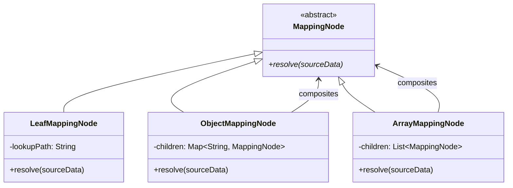

# Technical Design Specification: `json-mapper`

This document details the architectural blueprint and component design for `json-mapper`, a high-performance, modular, and patterns-driven Node.js CLI tool designed to structurally transform JSON arrays using a schema-based dictionary.

---

## 1. Architectural Boundaries (Clean Architecture)

Following the principles of Clean Architecture, the system is partitioned into concentric circles of control, with the core application policies residing in the center, entirely decoupled from peripheral infrastructure.

```mermaid
graph TD
    subgraph Infrastructure Layer (External Drivers)
        CLI[cli/bin.js]
        FS[fs/promises]
    end

    subgraph Adapters Layer (Interface Adapters)
        CLIController[adapters/controllers/CLIController.js]
        CLIPresenter[adapters/presenters/CLIPresenter.js]
        FileAdapter[adapters/repositories/FileRepositoryAdapter.js]
    end

    subgraph Use Cases Layer (Application Business Rules)
        MapUseCase[usecases/MapJsonUseCase.js]
        IFileRepo[usecases/ports/IFileRepository.js]
    end

    subgraph Domain Layer (Enterprise Business Rules)
        JSONMapper[domain/services/JSONMapper.js]
        LookupResolver[domain/services/LookupResolver.js]
        MappingNode[domain/model/MappingNode.js]
        LookupPath[domain/model/LookupPath.js]
    end

    CLI --> CLIController
    CLIController --> MapUseCase
    MapUseCase --> JSONMapper
    MapUseCase --> IFileRepo
    FileAdapter --> IFileRepo
    FileAdapter --> FS
    JSONMapper --> MappingNode
    JSONMapper --> LookupResolver
    LookupResolver --> LookupPath
```

### Dependency Inward Direction Rule
- **Domain Layer**: Houses pure JavaScript logic with zero external dependencies, modeling core enterprise rules and services. It remains entirely decoupled from physical environments.
- **Use Cases Layer**: Coordinates application-specific workflows, depending strictly on the inner Domain layer and abstract ports.
- **Interface Adapters**: Adapts abstract ports to database queries, repository streams, controller requests, and presentation handlers.
- **Infrastructure Layer**: Incorporates concrete file system operations, terminal arguments parsing (via third-party command libraries), logging mechanisms, and configuration registries.

---

## 2. Component Layout & Directory Structure

```
json-mapper/
├── .agents/
│   ├── AGENTS.md                   # Architectural governance rules
│   └── specs/
│       └── initial_scaffold.md      # [This Document] High-level architecture blueprint
├── src/
│   ├── domain/
│   │   ├── model/
│   │   │   ├── MappingNode.js       # Composite base class & leaf/composite nodes
│   │   │   └── LookupPath.js        # Parses and validates path queries
│   │   └── services/
│   │       ├── JSONMapper.js        # High-level engine orchestrating transformations
│   │       └── LookupResolver.js    # Strategy-driven recursive data selector
│   ├── usecases/
│   │   ├── ports/
│   │   │   └── IFileRepository.js   # DIP interface for input/output files
│   │   └── MapJsonUseCase.js        # Use Case orchestrating core transform steps
│   ├── adapters/
│   │   ├── controllers/
│   │   │   └── CLIController.js     # Parses options, triggers UseCase
│   │   ├── presenters/
│   │   │   └── CLIPresenter.js      # Decouples output formatting for terminal console
│   │   └── repositories/
│   │       └── FileRepositoryAdapter.js  # Implementation of IFileRepository using Node fs
│   └── infrastructure/
│       ├── cli/
│       │   └── bin.js               # Node CLI entrypoint
│       └── di/
│           └── container.js         # Dependency injection bootstrap wire-up
├── sample/
│   ├── initial_model.json           # Raw source test data array
│   └── dictionary.json              # Structural schema dictionary rules
├── test/                            # Comprehensive Test Suite
│   ├── unit/                        # Strict Kent Beck TDD red-green tests
│   └── integration/                 # End-to-end flow checks
├── package.json
└── README.md
```

---

## 3. Gang of Four (GoF) Design Patterns

To ensure high extensibility, testability, and structural elegance, we leverage three specific GoF structural and behavioral patterns:

### A. The Composite Pattern (Structural Resolution)
The target mapping schema (`dictionary.json`) is a deeply-nested structural JSON object. It can be modeled as a tree structure of `MappingNode` elements.
- **`MappingNode` (Component)**: Abstract base class exposing `resolve(sourceData)`.
- **`LeafMappingNode` (Leaf)**: Holds a lookup path string query (e.g. `propertyc[1]`). When `resolve(sourceData)` is called, it queries `LookupResolver` and returns the resolved primitive/value.
- **`ObjectMappingNode` (Composite)**: Holds child `MappingNode` properties. When `resolve(sourceData)` is called, it constructs and returns a new object with resolved properties.
- **`ArrayMappingNode` (Composite)**: Holds an ordered list of child `MappingNode` elements. When `resolve(sourceData)` is called, it returns a resolved array.

This abstraction allows the core mapper engine (`JSONMapper.js`) to process the dictionary structure recursively without caring about node types, maintaining extreme simplicity and strong adherence to the Open-Closed Principle (OCP).



### B. The Strategy Pattern (Segment Resolution Mechanics)
When traversing an input model with a query string like `propertyd.propertyd3[0]`, the path must be parsed and navigated safely. We represent the query as an array of path segments. Each segment has a dedicated evaluation strategy:
- **`ObjectPropertyStrategy`**: Resolves segment keys on objects: `source[segmentKey]`.
- **`ArrayIndexStrategy`**: Resolves index access on arrays: `source[segmentKey][index]`.

The strategies avoid fragile regex checks or dangerous `eval()` blocks during recursive traversal, allowing for high performance (John Resig's performance mechanics) and simple unit testing of individual resolver steps.

### C. The Adapter Pattern (File System Interface decoupling)
We decoupling core application logic from the Node.js `fs` module using an adapter:
- **Target Interface (`IFileRepository`)**: Defines functions `readJson(filePath)` and `writeJson(filePath, data)`.
- **Adapter (`FileRepositoryAdapter`)**: Implements `IFileRepository` using native `fs/promises`.
- This permits us to swap the persistent storage interface in the future (e.g., to MongoDB, S3 Bucket, or Mock memory repositories for unit testing) without touching a single line of Use Case or Domain code.

---

## 4. S.O.L.I.D. Boundary Scan & SOLID Principles Compliance

- **Single Responsibility Principle (SRP)**:
  - `LookupPath` has only one responsibility: parsing path strings.
  - `LookupResolver` has only one responsibility: executing value lookup on single objects.
  - `JSONMapper` handles the high-level iteration over input arrays.
  - `FileRepositoryAdapter` handles the physical disk I/O.
- **Open/Closed Principle (OCP)**: New mapping types (e.g., constant values in mappings, date formatting strategies, math expressions) can be introduced by subclassing `MappingNode` or adding a strategy, without changing `JSONMapper`.
- **Liskov Substitution Principle (LSP)**: All `MappingNode` subclasses (Leaf, Object, Array) can seamlessly substitute for each other inside `resolve()`.
- **Interface Segregation Principle (ISP)**: Interfaces such as `IFileRepository` are lean and only supply methods critical for this system's tasks.
- **Dependency Inversion Principle (DIP)**: `MapJsonUseCase` strictly depends on the abstract `IFileRepository` interface, never on concrete filesystem imports.

---

## 5. Performance & Safety Design (Kent Beck & John Resig Mechanics)

1. **Recursion Safety**: To prevent Stack Overflow exceptions on extremely nested inputs, recursion depth is capped and path resolutions are fully validated (ensuring non-null/undefined pointer checks) before diving deeper.
2. **Lookup Caching (Resig-style Memoization)**: If the same path (e.g., `propertyd.propertyd1`) is requested multiple times, its parsed segment AST representation is memoized inside `LookupPath` to save CPU-intensive string-parsing parsing cycles.
3. **Robust Array Parser**: Handles complex paths correctly (e.g. `propertyc[1]` and nested arrays if required).

---

## 6. Verification Plan

### Automated Tests (Kent Beck TDD Loop)
- **Unit Tests**:
  - `LookupPath`: Test parsing logic for plain keys, nested paths, and array subscripts (`property[0]`).
  - `LookupResolver`: Test lookup on null, undefined, arrays, nested structures, and invalid queries.
  - `MappingNode`: Test recursive composite resolution for leaf nodes, sub-objects, and arrays.
  - `JSONMapper`: Test mapping collections.
  - Test suite built with Mocha, Chai, or standard Node `test` module (relying on minimal/native frameworks).
- **Integration Tests**:
  - Execute the full `MapJsonUseCase` using a `MockFileRepository` with simulated JSON inputs.
  - Validate output JSON structure against the expected mapping.

### Manual Verification
- Execute command-line tool with sample files:
  `node src/infrastructure/cli/bin.js -i ./sample/initial_model.json -d ./sample/dictionary.json -o ./sample/output.json`
- Compare the created output against expected dictionary structures.

---

## 7. Architectural Evolution (Version 2)

For Version 2 specifications regarding the integration of external npm packages (`commander` and `pino`) without compromising our clean domain boundaries, refer to the [V2 Integration Specification](file:///c:/Source/json-mapper/.agents/specs/v2_npm_integration.md).

---

## 8. E2E Automation Blueprint

To validate the integration boundaries of the `json-mapper` tool without compromising the concentric layers, an E2E automation harness is implemented at the outermost edge (the **Infrastructure Layer**).

### E2E Architecture and Setup
- **Process Invocation**: Operates entirely outside the application boundary by running the physical Node executable `src/infrastructure/cli/bin.js` using `child_process.fork` or `child_process.exec`.
- **Complete Verification Lifecycle**:
  - Validates exit code transitions (0 for success, 1 for controlled errors).
  - Asserts output files contain the structurally projected and valid JSON maps matching our dictionaries.
  - Intercepts, collects, and parses standard process output streams (`stdout` and `stderr`) to extract structured Pino logs.
  - Verifies the operational telemetry event metrics are correctly recorded and emitted.
- **Clean Environment Separation**: Writes temporary execution files exclusively inside an isolated sandboxed directory `test/output/`, which is dynamically generated before execution and wiped clean upon test completion.

---

## 9. Stream Input and Unconditional File Output Architecture (v4)

### 9.1 Inward Dependency Rule & Dependency Mapping
Under Clean Architecture, the use case core is decoupled from physical input sources.
- **Existing Input-to-File Dependencies**:
  - [PathResolver.js](file:///c:/Source/json-mapper/src/infrastructure/cli/PathResolver.js) (Infrastructure) relies on checking file stats, globbing, and resolving file paths. It assumes input is a string file path.
  - [MapJsonUseCase.js](file:///c:/Source/json-mapper/src/usecases/MapJsonUseCase.js) (Use Case) loops over `files` array and calls `fileRepository.readJson(filePair.input)`.
  - [FileRepositoryAdapter.js](file:///c:/Source/json-mapper/src/adapters/repositories/FileRepositoryAdapter.js) (Adapter) calls `fs.readFile` using string file paths.
- **Existing Output Ownership**:
  - [PathResolver.js](file:///c:/Source/json-mapper/src/infrastructure/cli/PathResolver.js) decides output file paths and directory mappings.
  - [MapJsonUseCase.js](file:///c:/Source/json-mapper/src/usecases/MapJsonUseCase.js) coordinates output writing by passing target file paths to `fileRepository.writeJson`.
  - [FileRepositoryAdapter.js](file:///c:/Source/json-mapper/src/adapters/repositories/FileRepositoryAdapter.js) writes JSON strings to disk via `fs.writeFile`.

### 9.2 SOLID Boundary Refactoring (DIP & ISP)
To maintain the Inward Dependency Rule while supporting stream input:
1. **Define Dedicated `IStreamReader` Port**:
   Rather than widening the file-specific `IFileRepository` interface (which would violate ISP), we introduce a dedicated [IStreamReader.js](file:///c:/Source/json-mapper/src/usecases/ports/IStreamReader.js) port in the Use Cases layer:
   ```javascript
   export class IStreamReader {
     async readJson(stream) {
       throw new Error('Method "readJson(stream)" must be implemented.');
     }
   }
   ```
2. **Create `StreamReaderAdapter`**:
   Implement a new [StreamReaderAdapter.js](file:///c:/Source/json-mapper/src/adapters/repositories/StreamReaderAdapter.js) in the Adapters layer that implements `IStreamReader` and processes Node.js Readable streams asynchronously.
3. **Refactor `RequestDTO`**:
   Add an optional `inputStream` parameter to [RequestDTO](file:///c:/Source/json-mapper/src/usecases/dto/RequestDTO.js).
4. **Refactor `MapJsonUseCase`**:
   Update [MapJsonUseCase](file:///c:/Source/json-mapper/src/usecases/MapJsonUseCase.js)'s constructor to accept the new `IStreamReader` port as an optional dependency.
   Update `execute(request)` to check for `request.inputStream`:
   - If `request.inputStream` exists, it uses `this.streamReader.readJson(request.inputStream)` to fetch the source array, maps it, and writes it directly to `request.outputFile` using `this.fileRepository.writeJson`.
   - Otherwise, it falls back to the existing file path loop.
   - For telemetry, set `inputFile` to `"<stream>"` when streaming.

### 9.3 Interface Adapters & Dependency Wiring
1. **Refactor `CLIController`**:
   Modify [CLIController.js](file:///c:/Source/json-mapper/src/adapters/controllers/CLIController.js) to adapt its parameter validation:
   - If `requestDto.inputStream` is present, bypass the `files.length` check and verify that `requestDto.dictionaryFile` and `requestDto.outputFile` are present.
   - If `requestDto.inputStream` is absent, enforce standard file-path requirements (verifying that `requestDto.files` has matches).
2. **Wire Components in `container.js`**:
   Modify [container.js](file:///c:/Source/json-mapper/src/infrastructure/di/container.js) to:
   - Import `StreamReaderAdapter`.
   - Instantiate `StreamReaderAdapter` and inject it into the `MapJsonUseCase` constructor as the fourth parameter.

### 9.4 Infrastructure Layer (bin.js) Option Parsing
In [bin.js](file:///c:/Source/json-mapper/src/infrastructure/cli/bin.js):
- Register option `-s, --stream` (boolean flag to indicate stream input).
- Change `-i, --input` to be optional in Commander.
- Enforce infrastructure-level validation:
  - If `--stream` is provided, `--input` is forbidden.
  - If `--stream` is absent, `--input` is required.
  - If `--stream` is provided, verify that `--output` is provided and resolves to a file path (not an existing directory).
- **Environment Isolation Check**:
  - `bin.js` (Infrastructure) is responsible for accessing `process.stdin` (Node/OS detail) and passing it as `inputStream` into the `RequestDTO`. This prevents leaks of runtime environment details into the controller and use cases layers.

#### Presenter Flow Assessment:
- The [CLIPresenter.js](file:///c:/Source/json-mapper/src/adapters/presenters/CLIPresenter.js) component ONLY outputs console diagnostics (success metadata and execution errors) to `stdout`/`stderr`. It does **not** route the actual projected JSON output to `stdout` under any condition. Thus, no modifications are needed in `CLIPresenter.js` to satisfy the unconditional file output guarantee.

### 9.5 Compatibility & Versioning Recommendations
- **Input Change (Additive)**: Backward compatible. Callers using file paths continue to work without change.
- **Output Change (Breaking)**:
  - Making the output destination unconditionally a file path is a breaking change for callers expecting the tool to output the transformed data to stdout (if they wrap the utility or call it programmatically expecting a return value of the JSON stream).
  - **Version Bump & Changelog Recommendation**: The current version in `package.json` is `1.0.0` (while `bin.js` references `2.0.0` and specifications refer to v3). To resolve these version conflicts unambiguously and reflect the breaking nature of the output constraint, we recommend bumping the major version directly to **4.0.0**. We will document this in the changelog as:
    > **Breaking Change**: Output destination is unconditionally restricted to a physical file path. Optional output stdout routing is fully disabled.
    > **Additive Feature**: Introduces `--stream` (and `-s`) flag to support reading input data directly from standard input (stdin) or programmatic Node.js Readable streams.
