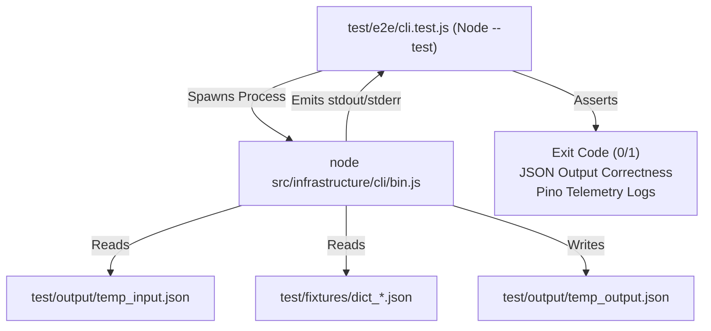

# Technical Design Specification: Version 2 End-to-End Automation Blueprint

This document details the architectural blueprint, directory configuration, and testing lifecycle specifications for the **Version 2 End-to-End (E2E) Test Suite** of the `json-mapper` CLI tool. 

---

## 1. Technical Evaluation & Context

The repository contains three structural pairs of randomized test fixtures and translation dictionaries located inside `test/fixtures/`:

1.  **Flat Mapping Pair**:
    - Source: `random_flat.json` (flat key-value structure).
    - Dictionary: `dict_flat.json` (projects trace ID, client profile, and legacy properties).
2.  **Nested Mapping Pair**:
    - Source: `random_nested.json` (deeply nested transaction and demographics dictionaries).
    - Dictionary: `dict_nested.json` (maps nested fields such as `customerProfile.PersonalData.FirstName` directly to flat properties).
3.  **Complex Arrays Mapping Pair**:
    - Source: `random_complex_arrays.json` (contains nested arrays of device telemetry data).
    - Dictionary: `dict_complex_arrays.json` (maps batch telemetry meta-fields and structural collection arrays).

### The Core Array Constraint Contradiction
The core domain mapping engine (`JSONMapper.mapCollection`) strictly expects a JSON array of objects as its source dataset. However, the randomized fixtures in `test/fixtures/` are structured as single JSON objects (dictionaries). 
- **Direct Invocation Behavior**: Invoking the CLI directly with raw single-object fixtures will throw a `TypeError: Source data must be an array of objects` and terminate with exit code `1`.
- **remind Solution**: To verify mapping correctness under successful scenarios, the E2E test harness must dynamically wrap the raw single-object fixtures inside arrays (`[sourceObject]`) and write them to temporary files before triggering the process. The E2E suite asserts both behaviors: process rejection for raw single objects, and successful execution for array-wrapped entities.

---

## 2. E2E Test Suite Architecture & Execution Model

The E2E test suite operates entirely at the peripheral boundary of the application (**Infrastructure Layer**), validating the physical entrypoint without importing inner components or mocking system behavior.



### Process Invocation Mechanism
E2E tests will run the CLI module using Node's native `child_process.fork` or `child_process.exec`.
- `child_process.fork` is preferred as it launches a new Node instance directly, allowing communication through message-passing or standard streams, while `child_process.exec` provides shell execution buffers.
- Target entrypoint: `src/infrastructure/cli/bin.js`.

### CLI Executable Configuration Parameters
- **Successful Execution Command**:
  ```bash
  node src/infrastructure/cli/bin.js -i test/output/temp_array_input.json -d test/fixtures/dict_flat.json -o test/output/temp_output.json
  ```
- **Failing Execution Command (Array Constraint Test)**:
  ```bash
  node src/infrastructure/cli/bin.js -i test/fixtures/random_flat.json -d test/fixtures/dict_flat.json -o test/output/temp_output.json
  ```

---

## 3. Complete Lifecycle Verification and Assertions

For each fixture pair, the E2E test runner executes the following complete verification lifecycle:

### A. Initialization Phase
- Creates the dynamic sandbox folder `test/output/` if it does not exist.
- Performs array wrapping on the selected fixture, writing the sanitized array dataset to `test/output/temp_input.json`.

### B. Process Invocation Phase
- Triggers the child process with arguments:
  `-i test/output/temp_input.json -d test/fixtures/dict_<type>.json -o test/output/temp_output.json`
- Collects standard output streams (`stdout` and `stderr`) and buffers them into an array of log lines.
- Listens for process close event to capture the `exitCode`.

### C. Assertions Phase
1.  **Exit Code Assertions**:
    - Asserts that a successful run exits with code `0`.
    - Asserts that an invalid raw single-object run exits with code `1`.
2.  **Output JSON Verification**:
    - Reads `test/output/temp_output.json` and parses it.
    - Asserts the output is a valid JSON array.
    - Compares the mapped values structurally against the expected schema dictionary.
3.  **Telemetry Logs Validation**:
    - Parses all captured stream lines in `stdout` as JSON.
    - Locates the operational telemetry performance log where `telemetry === true` and `metric === "mapping_execution_telemetry"`.
    - Asserts that `recordCount` is correct ($N = 1$).
    - Asserts that `durationMs` is a float greater than 0.
    - Asserts that physical file paths are logged accurately in telemetry.

### D. Cleanup Phase
- Erases all dynamically generated files inside `test/output/` securely.
- Leaves the repository in a clean state.

---

## 4. E2E Suite Directory Structure & Layout

The testing files and directory layout will conform to:

```
json-mapper/
├── test/
│   ├── fixtures/
│   │   ├── random_flat.json
│   │   ├── dict_flat.json
│   │   ├── random_nested.json
│   │   ├── dict_nested.json
│   │   ├── random_complex_arrays.json
│   │   └── dict_complex_arrays.json
│   ├── e2e/
│   │   └── cli.test.js           # [NEW] The End-to-End Test Suite
│   └── output/
│       └── .gitkeep              # Excludes test outputs from git tracking
├── .gitignore                    # Configured to ignore "test/output/*"
└── package.json                  # Integrates test commands
```

---

## 5. Draft Implementation Plan

Upon approval of this spec, the Full-Stack engineer subagent will perform the following execution steps:

1.  **Configure Git Exclusions**:
    - Append `/test/output/*` and `!test/output/.gitkeep` to `.gitignore`.
2.  **Create Test Folders**:
    - Create directories `test/e2e/` and `test/output/` with appropriate `.gitkeep` placeholders.
3.  **Implement `test/e2e/cli.test.js`**:
    - Code the Node native `node:test` framework script.
    - Leverage standard assertion libraries (`node:assert`).
    - Build process wrappers using `node:child_process`.
4.  **Integrate Test Executions**:
    - Verify that `npm test` runs both unit and E2E tests cleanly and quickly.
