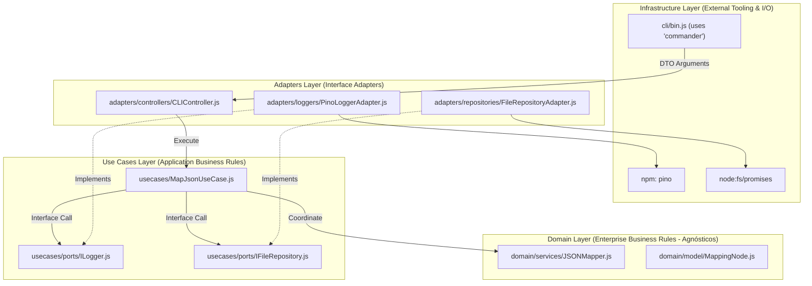
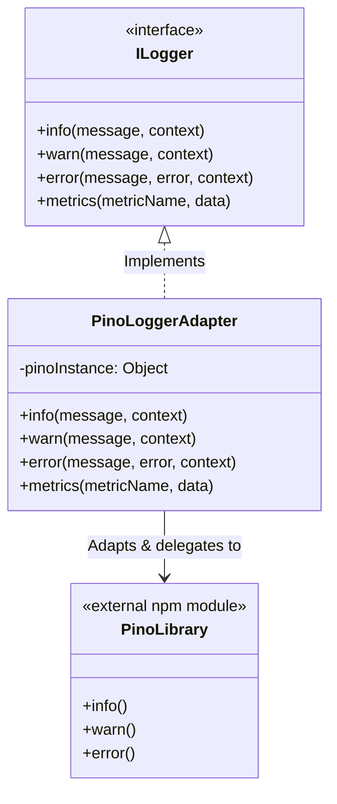
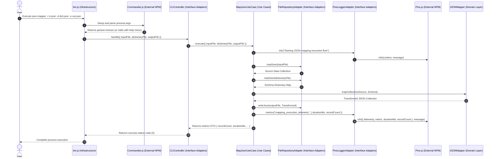

# Technical & Functional Specification: V2 NPM Modules Integration

This document details the architectural blueprint and technical specifications for **Version 2** of the `json-mapper` CLI tool. The primary objective is to integrate external npm dependencies (`commander` and `pino`) without violating our **Clean Architecture** boundaries or **S.O.L.I.D.** principles.

---

## STEP 0: The Functional Domain Assessment (V2)

Before selecting physical packages or runtime libraries, we assess the Version 2 requirements from a pure, mathematical domain perspective, isolated from I/O mechanisms or logging engines.

### 1. Abstract Parameter Input Schema
The application requires three configuration strings to initiate a transformation. We define this input contract abstractly:

$$\text{RequestDTO} = \{ \text{inputFile}: \text{PathString}, \text{dictionaryFile}: \text{PathString}, \text{outputFile}: \text{PathString} \}$$

This DTO is a flat, behaviorless data structure encapsulating the client's intent. Any delivery mechanism (CLI arguments, HTTP request, messaging queue, test runner) must compile this structure and hand it to the core application layer.

### 2. Conceptual Logging & Telemetry Model
The business domain requires capturing operational events during a transformation's lifecycle. We conceptualize this as an abstract **Event & Telemetry Model**:

1.  **System Events**:
    *   **Information (Info)**: Workflow transitions (e.g., transformation initiated, resource loaded, transformation completed).
    *   **Warnings**: Non-fatal anomalies with fallback defaults (e.g., empty source collections or path resolutions falling back gracefully to undefined).
    *   **Errors**: Catastrophic execution halts (e.g., file not found, malformed schemas, type mismatches).

2.  **Operational Metrics**:
    Let $S$ be the source dataset collection with cardinality $N = |S|$, and let $t_{start}$ and $t_{end}$ represent the start and end absolute timestamps of the transformation. We define:
    *   **Dataset Cardinality ($N$)**: Total records successfully processed.
    *   **Execution Duration ($\Delta t$)**: The net calculation duration in milliseconds:
        $$\Delta t = t_{end} - t_{start}$$

### 3. Edge-Case Invariant Guardrails (V2)
Conceptual safety rules added to the domain boundaries:

| Anomaly Condition | Domain Behavior | Telemetry Response |
| :--- | :--- | :--- |
| **Incomplete Arguments** | Reject execution instantly with a structural type error. | Emit structured Error capturing missing parameters. |
| **File I/O Failures** | Terminate flow immediately and bubble up a controlled repository exception. | Emit structured Error enclosing I/O trace and path details. |
| **Invalid Schema Dictionary** | Halt compilation and raise an AST validation exception. | Emit structured Error detailing the syntax or tree compilation failure. |

---

## STEP 1: Technical Specification Mapping (V2)

With our functional domain established, we design the software layers using **Clean Architecture** and **GoF Design Patterns** to ensure that our inner application layers remain agnostically isolated.

### 1. The Inward Dependency Rule (Clean Architecture)

The core layers (Core Domain and Use Cases) reside at the center and have **zero** knowledge of `commander` or `pino`. Dependencies flow exclusively inward:



---

### 2. SOLID Boundary Scan: Decoupling the Logger

To adhere to the **Dependency Inversion Principle (DIP)**, we define an abstract port interface for the logging system in the Use Cases layer. High-level policies depend strictly on this abstraction, freeing them from direct coupling with external libraries.

#### Logger Port: [ILogger.js](file:///c:/Source/json-mapper/src/usecases/ports/ILogger.js) (Use Case Layer)
This file defines the abstract contract that core components use:

```javascript
/**
 * Abstract Interface for Logging and Telemetry.
 * Complies with the Dependency Inversion Principle (DIP).
 */
export class ILogger {
  info(message, context = {}) {
    throw new Error('Method "info(message, context)" must be implemented.');
  }

  warn(message, context = {}) {
    throw new Error('Method "warn(message, context)" must be implemented.');
  }

  error(message, error, context = {}) {
    throw new Error('Method "error(message, error, context)" must be implemented.');
  }

  metrics(metricName, data = {}) {
    throw new Error('Method "metrics(metricName, data)" must be implemented.');
  }
}
```

---

### 3. GoF Pattern Applied: Structural Adapter Pattern for Logging

To bridge the third-party structured logging library `pino` into our abstract domain, we apply the GoF **Adapter** pattern:



#### Concrete Adapter: [PinoLoggerAdapter.js](file:///c:/Source/json-mapper/src/adapters/loggers/PinoLoggerAdapter.js) (Adapters Layer)
Maps the library-agnostic `ILogger` calls to the specific JSON structured log formats of `pino`:

```javascript
import pino from 'pino';
import { ILogger } from '../../usecases/ports/ILogger.js';

export class PinoLoggerAdapter extends ILogger {
  constructor(options = {}) {
    super();
    // Initialize pino with preferred JSON structured logs and ISO time formats
    this.pinoInstance = pino({
      level: options.level || 'info',
      timestamp: pino.stdTimeFunctions.isoTime,
      ...options
    });
  }

  info(message, context = {}) {
    this.pinoInstance.info(context, message);
  }

  warn(message, context = {}) {
    this.pinoInstance.warn(context, message);
  }

  error(message, error, context = {}) {
    this.pinoInstance.error(
      { 
        err: {
          message: error.message,
          stack: error.stack
        },
        ...context
      }, 
      message
    );
  }

  metrics(metricName, data = {}) {
    // Log metrics under structured telemetry keys for indexers/aggregators (Elastic, Loki, Datadog)
    this.pinoInstance.info(
      { 
        telemetry: true, 
        metric: metricName, 
        ...data 
      }, 
      `Telemetry Metric: ${metricName}`
    );
  }
}
```

---

### 4. Telemetry-Enabled Use Case Orchestration

The `MapJsonUseCase` interacts strictly with the `ILogger` port, maintaining clean boundaries. It measures elapsed duration with microsecond precision and triggers telemetry logs at critical workflow nodes.

#### Updated Use Case: [MapJsonUseCase.js](file:///c:/Source/json-mapper/src/usecases/MapJsonUseCase.js)

```javascript
import { performance } from 'node:perf_hooks';
import { JSONMapper } from '../domain/services/JSONMapper.js';

export class MapJsonUseCase {
  constructor(fileRepository, logger, jsonMapper = new JSONMapper()) {
    this.fileRepository = fileRepository;
    this.logger = logger;
    this.jsonMapper = jsonMapper;
  }

  async execute({ inputFile, dictionaryFile, outputFile }) {
    if (!inputFile || !dictionaryFile || !outputFile) {
      const paramError = new Error('All parameters (inputFile, dictionaryFile, outputFile) are required');
      this.logger.error('Invalid arguments provided to MapJsonUseCase', paramError);
      throw paramError;
    }

    this.logger.info('Starting JSON mapping execution flow', { inputFile, dictionaryFile, outputFile });
    const startTime = performance.now();

    try {
      // 1. Load resource payloads using DIP repository ports
      const sourceData = await this.fileRepository.readJson(inputFile);
      this.logger.info('Source dataset successfully loaded', { records: sourceData.length });

      const dictionarySchema = await this.fileRepository.readJson(dictionaryFile);

      // 2. Execute purely functional transformations in the domain core
      const transformed = this.jsonMapper.mapCollection(sourceData, dictionarySchema);

      // 3. Persist results
      await this.fileRepository.writeJson(outputFile, transformed);

      // 4. Capture Operational Metrics
      const durationMs = parseFloat((performance.now() - startTime).toFixed(2));
      const recordCount = sourceData.length;

      this.logger.info('JSON mapping execution flow completed successfully', { outputFile });

      // Log structured operational telemetry
      this.logger.metrics('mapping_execution_telemetry', {
        durationMs,
        recordCount,
        inputFile,
        outputFile
      });

      return {
        recordCount,
        durationMs,
        inputFile,
        dictionaryFile,
        outputFile
      };
    } catch (error) {
      this.logger.error('JSON mapping execution flow failed catastrophically', error, {
        inputFile,
        dictionaryFile,
        outputFile
      });
      throw error;
    }
  }
}
```

---

### 5. Decoupled CLI Delivery Mechanism (Commander)

The CLI framework lives on the absolute edge (**Infrastructure**). By encapsulating `commander` here, we parse terminal configurations, build option validations, auto-compile `--help` flags, and dispatch flat commands down to our adapters without cross-layer pollution.

#### Command Flow & Control Sequence:



#### Entrypoint CLI: [bin.js](file:///c:/Source/json-mapper/src/infrastructure/cli/bin.js) (Infrastructure Layer)

```javascript
#!/usr/bin/env node

import { Command } from 'commander';
import { bootstrap } from '../di/container.js';

async function run() {
  const program = new Command();

  program
    .name('json-mapper')
    .description('⚡ High-Performance Patterns-Driven JSON Transformer CLI')
    .version('2.0.0');

  program
    .requiredOption('-i, --input <file>', 'Path to the source JSON dataset file (array format)')
    .requiredOption('-d, --dict <file>', 'Path to the mapping schema dictionary JSON file')
    .requiredOption('-o, --output <file>', 'Path to write the resulting transformed JSON output file');

  program.parse(process.argv);

  const options = program.opts();

  // Bootstrap compiles dependencies and injects PinoLoggerAdapter
  const container = bootstrap();

  const exitCode = await container.cliController.handle({
    inputFile: options.input,
    dictionaryFile: options.dict,
    outputFile: options.output
  });

  process.exitCode = exitCode;
}

run();
```

#### Interface Controller: [CLIController.js](file:///c:/Source/json-mapper/src/adapters/controllers/CLIController.js) (Adapters Layer)
Handles UI presenter calls and interacts with the Use Case. Since inputs are verified on the boundary, parsing is streamlined.

```javascript
export class CLIController {
  constructor(mapJsonUseCase, cliPresenter, logger) {
    this.mapJsonUseCase = mapJsonUseCase;
    this.cliPresenter = cliPresenter;
    this.logger = logger;
  }

  async handle({ inputFile, dictionaryFile, outputFile }) {
    try {
      const resultMetrics = await this.mapJsonUseCase.execute({
        inputFile,
        dictionaryFile,
        outputFile
      });

      this.cliPresenter.presentSuccess(resultMetrics);
      return 0;
    } catch (error) {
      this.logger.warn('CLI Controller execution completed with failures', { error: error.message });
      this.cliPresenter.presentError(error);
      return 1;
    }
  }
}
```

---

## 3. Updated File Layout

This structure showcases exactly where new ports, adapters, and libraries fit in without breaking hierarchy:

```
json-mapper/
├── .agents/
│   └── specs/
│       ├── functional_domain.md     # Retroactive Pure Domain Assessment (V1)
│       ├── initial_scaffold.md      # Technical Specification Scaffold (V1)
│       └── v2_npm_integration.md    # [This Document] Version 2 Architectural Blueprint
├── src/
│   ├── domain/                      # Domain Layer (Enterprise Rules - Agnósticos)
│   │   ├── model/
│   │   │   ├── MappingNode.js
│   │   │   └── LookupPath.js
│   │   └── services/
│   │       ├── JSONMapper.js
│   │       └── LookupResolver.js
│   ├── usecases/                    # Use Cases Layer (Application Business Rules)
│   │   ├── ports/
│   │   │   ├── IFileRepository.js
│   │   │   └── ILogger.js           # [NEW] Abstract Port for logging/telemetry
│   │   └── MapJsonUseCase.js        # [MODIFIED] Telemetry-aware execution logic
│   ├── adapters/                    # Adapters Layer (Interface Adapters)
│   │   ├── controllers/
│   │   │   └── CLIController.js     # [MODIFIED] Receives verified inputs, triggers UseCase
│   │   ├── presenters/
│   │   │   └── CLIPresenter.js
│   │   ├── loggers/
│   │   │   └── PinoLoggerAdapter.js # [NEW] Implements ILogger wrapping pino
│   │   └── repositories/
│   │       └── FileRepositoryAdapter.js
│   └── infrastructure/              # Infrastructure Layer (Peripherals & I/O)
│       ├── cli/
│       │   └── bin.js               # [MODIFICADO] CLI program setup using commander
│       └── di/
│           └── container.js         # [MODIFICADO] Wire up and inject PinoLoggerAdapter
├── package.json                     # Declares npm: "commander", "pino"
└── README.md
```

---

## STEP 2: Verification Plan (TDD & Quality Gates)

To ensure operational stability and prevent regression before delegating implementation code to a full-stack engineer:

### 1. Isolated Unit Testing (Kent Beck TDD Loop)
*   **`PinoLoggerAdapter`**:
    *   Verify it implements the `ILogger` class structure.
    *   Mock the internal `pino` module to verify calls to `.info()`, `.warn()`, `.error()`, and `.metrics()` pass exact argument schemas and objects.
*   **`MapJsonUseCase` (with `MockLogger`)**:
    *   Create a simple `MockLogger` spy.
    *   Test successful path: check that `.info()` logs occur at execution start and file load events, and `.metrics()` executes once with floating-point `durationMs` and a non-zero `recordCount`.
    *   Test error path: force a repository file read rejection, then assert that `logger.error()` records the error and context metadata before rethrowing.

### 2. End-to-End System Testing
*   **CLI Option Validation**:
    *   Run `node src/infrastructure/cli/bin.js` without options; confirm `commander` intercepts, exits with code `1`, and displays auto-help cleanly.
*   **Complete System Execution**:
    *   Process sample JSON payloads and schemas to verify structural file conversions, validation logs, and clean stdout telemetry logging outputs.
