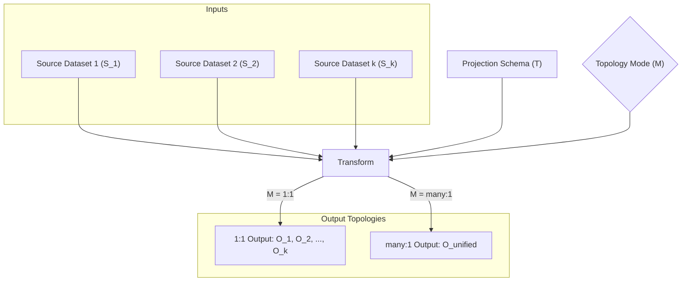

# Step 0 & Step 1 Blueprint: Multi-File & Directory-Wide Mapping (v3)

This document formalizes the retroactive Functional Domain Assessment (Step 0) and Technical Specification Mapping (Step 1) for expanding the `json-mapper` tool to support multi-file inputs, directory scanning, wildcard glob pattern resolution, mapping topologies (`1:1` and `many:1`), and aggregated microsecond-precision execution telemetry.

---

# Step 0: The Functional Domain Assessment

## 1. Abstract Schema Contracts

We expand the transformation domain of `json-mapper` from transforming a single source dataset to a batch transformation of multiple input datasets $S_{inputs} = \langle S_1, S_2, \dots, S_k \rangle$ governed by a unified projection schema $T$ and a target execution mode $M$.

Let each input dataset $S_i$ be an ordered collection of source objects:
$$S_i = \langle s_{i,1}, s_{i,2}, \dots, s_{i,n_i} \rangle$$
Where $n_i$ represents the record count of the $i$-th dataset.



### Transformation Topologies ($M$)

The target mapping output structures are governed by the topology mode $M \in \{ \text{"1:1"}, \text{"many:1"} \}$:

1. **1-to-1 Mapping Mode ($M = \text{"1:1"}$)**:
   Maps each source dataset array $S_i$ to a corresponding transformed output dataset $O_i$ containing individually mapped objects.
   $$O_i = [ T(s) \mid s \in S_i ] \quad \forall i \in \{1, \dots, k\}$$
   This yields exactly $k$ projected output files.

2. **Many-to-1 Mapping Mode ($M = \text{"many:1"}$)**:
   Concatenates all source objects across all datasets into a single unified input sequence $S_{flat}$ and projects it into a single output array $O_{unified}$:
   $$S_{flat} = S_1 \mathbin{\Vert} S_2 \mathbin{\Vert} \dots \mathbin{\Vert} S_k$$
   $$O_{unified} = [ T(s) \mid s \in S_{flat} ]$$
   This yields a single unified output file containing $\sum_{i=1}^k n_i$ mapped objects.

---

## 2. Pure Transformation Logic

The domain transformation logic operates on a set of resolved input datasets. The actual resolution of physical files, wildcards, and directory files is external to the pure transformation logic (which only consumes resolved, structured memory streams).

Let the transformation operator $\mathcal{T}(S_{inputs}, T, M)$ be defined as:

$$\mathcal{T}(S_{inputs}, T, M) = \begin{cases} 
\langle O_1, O_2, \dots, O_k \rangle & \text{where } O_i = [ T(s) \mid s \in S_i ] \quad \text{if } M = \text{"1:1"} \\
O_{unified} = \bigcup_{i=1}^k [ T(s) \mid s \in S_i ] & \text{if } M = \text{"many:1"}
\end{cases}$$

---

## 3. Edge-Case Invariant Guardrails

To preserve execution predictability and prevent corrupt state output, the transformation boundaries are governed by the following strict invariants:

| Input/State Anomaly | Operational Impact | Invariant Guardrail Behavior |
| :--- | :--- | :--- |
| **No Matches Found** | Wildcard/directory pattern yields zero files | **Throw Error**: `"No input files found matching pattern: [pattern]"` |
| **Empty Directory** | Directory input contains no `.json` files | **Throw Error**: `"No JSON files found in directory: [directoryPath]"` |
| **Malformed JSON File** | One of the matching input files is corrupted or not a valid JSON array | **Atomic Transaction Failure**: Throw error immediately and abort. Prevents partial/corrupted batch output. |
| **Output Path Conflict (1:1 Multi-File)** | Mode is `1:1`, input is multiple files, but `--output` is specified as a file (not directory) | **Throw Validation Error**: `"In 1:1 mode with multiple files, output path must point to a directory."` |
| **Directory Auto-Creation** | Output directory path in `1:1` or `many:1` mode does not exist | **Auto-Creation**: Recursively generate the output directory structure before writing. |

---

## 4. Telemetry Tracking Domain Specifications

The telemetry module must accumulate data across the entire execution transaction. The metrics are logged as a single aggregate telemetry metric event to the `ILogger` port upon completion:

- **Total Microsecond Duration ($D_{us}$)**: The total execution duration (from initial file reads to final output writes) measured in microseconds ($\mu\text{s}$).
- **Processed File Count ($C_{file}$)**: The count of resolved input files processed in the transaction.
- **Aggregate Object Count ($N_{total}$)**: The total number of source objects mapped across all files.

The telemetry metric schema is:
$$\text{MetricData} = \{ \text{telemetry}: \text{true}, \text{metric}: \text{"mapping_execution_telemetry"}, \text{durationUs}: D_{us}, \text{processedFileCount}: C_{file}, \text{aggregateObjectCount}: N_{total}, \text{mode}: M \}$$

---

# Step 1: The Technical Specification Mapping

## 1. Architectural Boundaries (Clean Architecture)

Under Clean Architecture boundaries, all file globbing, directory expansion, and system-level file-path calculations reside strictly in the peripheral **Infrastructure Layer**. The inner **Use Cases** and **Domain** layers operate entirely on clean, high-level data models and DTOs.

```mermaid
graph TD
    subgraph Infrastructure Layer (Peripheral Boundary)
        CLI[cli/bin.js]
        PathResolver[cli/PathResolver.js]
        FS[fs/promises]
    end

    subgraph Interface Adapters Layer
        CLIController[adapters/controllers/CLIController.js]
        CLIPresenter[adapters/presenters/CLIPresenter.js]
        FileAdapter[adapters/repositories/FileRepositoryAdapter.js]
    end

    subgraph Use Cases Layer (Core Business Workflows)
        MapUseCase[usecases/MapJsonUseCase.js]
        RequestDTO[usecases/dto/RequestDTO.js]
        IFileRepo[usecases/ports/IFileRepository.js]
        ILogger[usecases/ports/ILogger.js]
    end

    subgraph Domain Layer (Pure Enterprise Rules)
        JSONMapper[domain/services/JSONMapper.js]
    end

    CLI -->|Parses options & triggers| PathResolver
    PathResolver -->|Resolves paths to DTO| RequestDTO
    CLI -->|Invokes with DTO| CLIController
    CLIController -->|Executes DTO| MapUseCase
    MapUseCase -->|Reads/Writes JSON| IFileRepo
    MapUseCase -->|Calls compilation & mapping| JSONMapper
    MapUseCase -->|Logs aggregate metrics| ILogger
    FileAdapter -->|Implements| IFileRepo
    FileAdapter -->|Calls Node| FS
```

### The Inward Dependency Rule Enforcement
1. **Infrastructure (CLI & PathResolver)**: Resolves directories and wildcards using native Node.js `node:fs/promises` `glob` and file stats. It translates raw arguments into a standardized `RequestDTO` where all file input/output path assignments are already resolved to literal file path strings.
2. **Interface Adapters (CLIController)**: Accepts `RequestDTO`, validates structural parameters, executes the UseCase, and forwards execution telemetry to the `CLIPresenter`.
3. **Use Cases (MapJsonUseCase)**: Orchestrates the batch mapping process. It reads, maps, aggregates, and writes files by interacting with the `IFileRepository` port. It remains entirely platform-agnostic and does not use Node's `path` module.

---

## 2. Component Design & Standardized DTOs

### Standardized Request DTO (`RequestDTO`)

The CLI Controller and UseCase consume a unified request DTO containing pre-resolved input-to-output file mappings. This decouples the core logic from physical wildcards and directory structures.

```javascript
// src/usecases/dto/RequestDTO.js
export class RequestDTO {
  /**
   * @param {Object} params
   * @param {string} params.mode - '1:1' | 'many:1'
   * @param {string} params.dictionaryFile - Path to the schema dictionary
   * @param {Array<{input: string, output?: string}>} params.files - Resolved input/output file path pairs
   * @param {string} [params.outputFile] - Single target output path (only used in many:1 mode)
   */
  constructor({ mode, dictionaryFile, files, outputFile }) {
    this.mode = mode;
    this.dictionaryFile = dictionaryFile;
    this.files = files;
    this.outputFile = outputFile;
  }
}
```

#### File Resolution Scenarios via Infrastructure Layer (`PathResolver`)
- **Mode: `many:1`**:
  Input: `src/data/*.json`, Output: `dist/combined.json`
  Resolved RequestDTO:
  ```javascript
  new RequestDTO({
    mode: 'many:1',
    dictionaryFile: 'schema.json',
    files: [
      { input: 'src/data/file1.json' },
      { input: 'src/data/file2.json' }
    ],
    outputFile: 'dist/combined.json'
  })
  ```
- **Mode: `1:1`**:
  Input: `src/data/*.json`, Output: `dist/output` (Directory)
  Resolved RequestDTO:
  ```javascript
  new RequestDTO({
    mode: '1:1',
    dictionaryFile: 'schema.json',
    files: [
      { input: 'src/data/file1.json', output: 'dist/output/file1.json' },
      { input: 'src/data/file2.json', output: 'dist/output/file2.json' }
    ]
  })
  ```

---

## 3. SOLID & Gang of Four (GoF) Patterns Applied

- **GoF Adapter Pattern (IFileRepository & Globbing isolation)**: Native `fs/promises` operations remain encapsulated in `FileRepositoryAdapter`. Globbing and path-joining logic remain isolated in the infrastructure-level `PathResolver` wrapper, which acts as a boundary adapter between OS filesystem patterns and our clean code representations.
- **GoF Command / DTO Pattern (Standardized RequestDTO)**: Formalizing inputs in `RequestDTO` isolates parameter mutations. It allows executing multi-file mapping flows programmatically from other driver files (like a web controller or direct script) without modification.
- **Dependency Inversion Principle (DIP)**: `MapJsonUseCase` strictly depends on `IFileRepository` and `ILogger` interfaces. It is never exposed to path manipulation functions or platform-specific separator formats (`/` vs `\`).

---

## 4. Proposed Architectural Changes

### Infrastructure Layer

#### `[NEW] PathResolver` ([PathResolver.js](file:///c:/Source/json-mapper/src/infrastructure/cli/PathResolver.js))
Provides file globbing, directory inspection, and output path mappings. It returns a standardized `RequestDTO` using:
- `import { glob } from 'node:fs/promises'` (native to Node 22+)
- `fs.stat` to distinguish files from directories
- `path.basename`, `path.join`, and `path.resolve` to format targets.

#### `[MODIFY] bin.js` ([bin.js](file:///c:/Source/json-mapper/src/infrastructure/cli/bin.js))
- Integrate the `--mode <1:1|many:1>` configuration option (default to `1:1`).
- Call `PathResolver.resolve()` to expand paths.
- Instantiate `RequestDTO` and pass it to `container.cliController.handle()`.

### Interface Adapters Layer

#### `[MODIFY] CLIController` ([CLIController.js](file:///c:/Source/json-mapper/src/adapters/controllers/CLIController.js))
- Receive standard `RequestDTO`.
- Perform DTO-level validations (e.g. verify if the resolved `files` array is non-empty, and validate output formats).
- Forward DTO to `MapJsonUseCase.execute()`.

### Use Cases Layer

#### `[MODIFY] MapJsonUseCase` ([MapJsonUseCase.js](file:///c:/Source/json-mapper/src/usecases/MapJsonUseCase.js))
- Redesign `execute()` to consume `RequestDTO`.
- Load `dictionarySchema` once.
- Loop over `files`:
  - Read input file.
  - Apply mapping transformation.
  - If `1:1`: write transformed output to the corresponding `output` file immediately.
  - If `many:1`: accumulate transformed items into a single in-memory array.
- If `many:1`: write the single accumulated array to the root `outputFile`.
- Time entire execution loop using microsecond calculation:
  $$D_{us} = \text{Math.round}((\text{performance.now}() - T_{start}) * 1000)$$
- Emit structured metric event `mapping_execution_telemetry` via `ILogger.metrics`.

---

# Verification Plan

### Automated Tests (Kent Beck TDD Loop)

#### Unit Tests (`test/unit/`)
1. **`PathResolver.test.js`**: Verify file list expansions:
   - Single file path.
   - Directory scan (resolving all `.json` files).
   - Wildcard pattern matching (using native `glob`).
   - Validate DTO output layout for both `1:1` and `many:1` modes.
   - Verify path validation throws for non-existent directories and empty matches.
2. **`MapJsonUseCase.test.js`**:
   - Verify UseCase behaves correctly under `1:1` mode (reads multiple files, writes multiple files, compile schema once).
   - Verify UseCase behaves correctly under `many:1` mode (concatenates mapped files into a single output).
   - Assert `mapping_execution_telemetry` logs the correct accumulated record count, file count, and microsecond duration.
3. **`CLIController.test.js`**:
   - Assert validation failures on empty files array.
   - Assert successful forwarding of DTO.

#### End-to-End Tests (`test/e2e/`)
1. **`multi-file-lifecycle.test.js`**:
   - Run the child process on `src/infrastructure/cli/bin.js`.
   - Test directory input matching `-i test/fixtures -o test/output/dir --mode 1:1`. Assert multiple output files are created with correct mapped records.
   - Test glob pattern input matching `-i "test/fixtures/*.json" -o test/output/merged.json --mode many:1`. Assert a single file is written with the aggregated mapping array.
   - Verify process exits with `0` on success and logs the accumulated telemetry data to `stdout`.
   - Verify failure cases (empty directory, invalid file format) exit with `1` and clean up sandboxed outputs.
